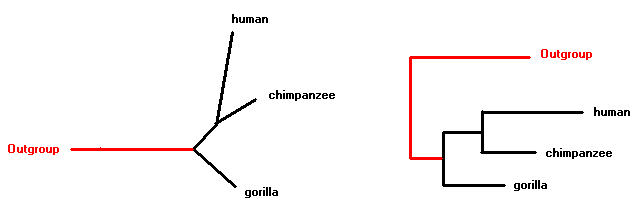

## Trees

The basic element of phylogenetics is the **tree**, a graphical representation of the relationships between different organisms or taxa. It is composed by a series of **nodes** connected by **branches**.

The nodes can be **terminal** (corresponding to the taxa that we are studying) or **internal**. There are **three** branches splitting from each node, each of them can lead to a terminal node or an internal node.

Trees can be **rooted** or **unrooted**. An unrooted tree just shows the relationships between the taxa and the distance between them, but it can’t determine which ones are in more **basal** or derived positions.

