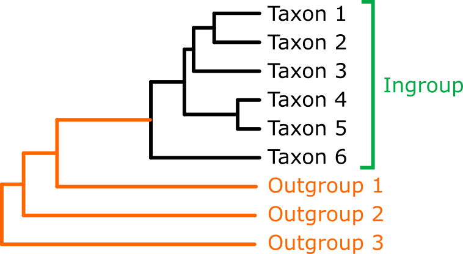

## Trees

The basic element of phylogenetics is the **tree**, a graphical representation of the relationships between different organisms or taxa. It is composed by a series of **nodes** connected by **branches**.

The nodes can be **terminal** (corresponding to the taxa that we are studying) or **internal**. There are **three** branches splitting from each node, each of them can lead to a terminal node or an internal node.

Trees can be **rooted** or **unrooted**. An unrooted tree just shows the relationships between the taxa and the distance between them, but it can’t determine which ones are in more **basal** or derived positions.

In this picture, the tree on the left is unrooted. The tree on the right is rooted. They are the same tree, but on the right side the tree is oriented in a way that we can determine in which direction the clades originate. For example, we can see that humans and chimpanzees are closely related, and that gorillas diverged earlier in the evolution of this group. We are unable to see this pattern in the unrooted tree.

**Be aware that the real "shape" of a tree is the unrooted version!** Rooting a tree is usually an artificial modification that we do in order to make a better interpretation. Some phylogenetic programs produce unrooted trees as output, and when we open them in a tree viewer software we may think that they are rooted. Be careful with this!

In order to root a tree, we can use different methods:

- **Mid-point rooting**: It takes the two most distant taxa, and places the root in the mid-point between them. This premise is very weak, so using this method is not advisable.
- **Outgroup**: This method is based on including at least one taxon that is external to our study group, and places the root between this taxon and our ingroup. It is recommended to include at least three outgroups that have a paraphyletic relationship with our ingroup.

