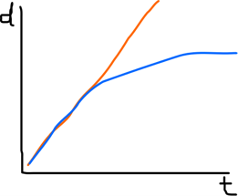

# Nucleotide substitution models

## The problem

As organisms evolve, their DNA accumulates mutations. This may lead us to think that, if we compare the same DNA marker from two organims and count the number of different nucleotides, we can directly infer how much evolutionary distance is between them.

This is false.

Why? Because the number of differences between two nucleotide sequences is not proportional to their time of divergence. One difference between two sequences does not mean that there was only one change.

For example, if we have an `A` in one sequence and a `C` in the other sequence, this can be the result of:

1. The ancestor had `A`, and there was one mutation in the second sequence: 1 observed difference, 1 change.
2. The ancestor had `C`, and there was one mutation in the first sequence: 1 observed difference, 1 change.
3. The ancestor had `A`, and it changed to `G` and then to `C` in the second sequence: 1 observed difference, **2 changes**.
4. The ancestor had `G`, and it changed to `A` in the first sequence and to `C` in the second: 1 observed difference, **2 changes**.
5. The ancestor had `G`, and then it changed to `T` and later to `A` in the first sequence, and to `C`, then to `G`, and then back to `C` in the second sequence: 1 observed difference, **5 changes**.

Additionally, we can have cases in which the same nucleotide in both sequences (**0 observed differences**) come from identical changes from a different ancestral nucleotide (**2 changes**). Or many other different cases...

If we plot the number of observed differences between two sequences (d) against the real evolutionary distance between them (t) we observe this graph: 

In orange, we see the expected line (differences = distance), but in blue we can see the real line. Two extremely distant and unrelated sequences will not usually differ more than a 75%. This has also some logic: if we create two nucleotide sequences by pressing the A, C, G and T keys randomly, 25% of their nucleotides will be identical, just by simple probability.

## Nucleotide substitution models: the basics

In order to deal with this problem, the nucleotide substitution models were created.

The models have a series of parameters:

-	On one hand, we have a **substitution matrix** that define the substitution rates from one nucleotide to another. It has four rows and four columns, representing the four nucleotides in alphabetical order (A, C, G, T). For example, the element in the second row, third column, represents the rate of change from C to G.
-	On the other hand, we have a **frequency matrix** that represents the frequency of each nucleotide in our dataset. 

The most simple model is the one proposed by Jukes and Cantor in 1969 (**Jukes&Cantor, JC**). It considers that the substitution rates are identical for every nucleotide, as well as their frequencies:

$$P_{i} = 
 \begin{bmatrix}
  . & \alpha & \alpha & \alpha \\
  \alpha & . & \alpha & \alpha \\
  \alpha & \alpha & . & \alpha \\
  \alpha & \alpha & \alpha & . \\
 \end{matrix}
$$

